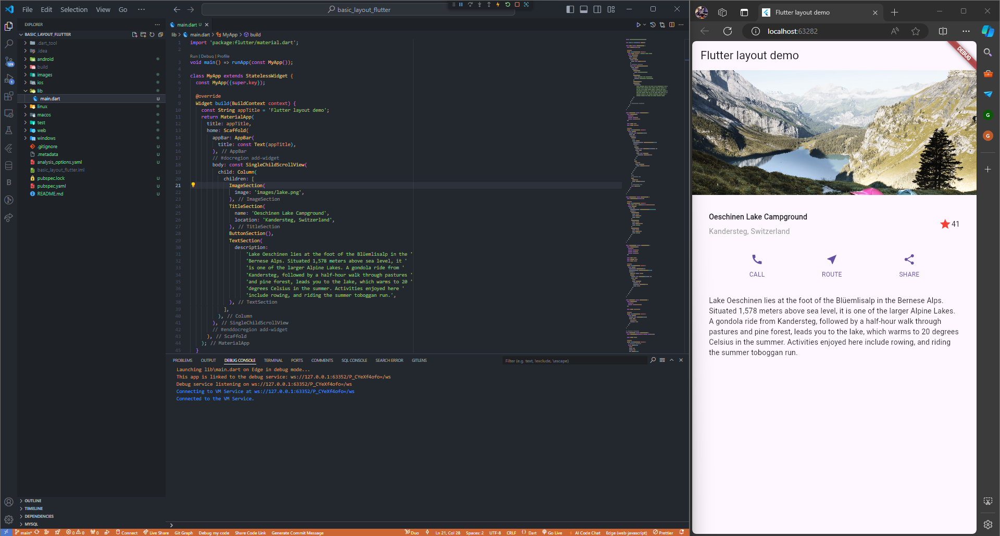

# TUGAS PRAKTIKUM PERTEMUAN 6
#  Layout dan Navigasi   

### Nama : Cyndu Fathur Rohman
### Kelas : TI-3G
### No Absen : 10   

### Link Repository Praktikum 
Silakan implementasikan di project baru "basic_layout_flutter" dengan mengakses sumber ini: https://docs.flutter.dev/codelabs/layout-basics
- basic_layout_flutter (Tugas Praktikum 1 no 2.): https://github.com/CFathurrohman/basic_layout_flutter

  
Hasil :
